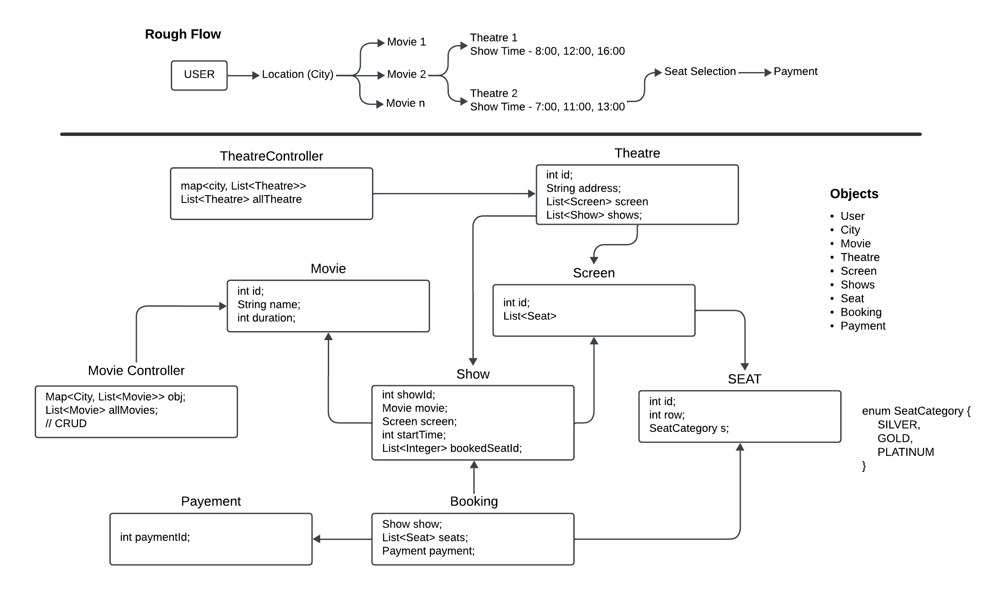

# BookMyShow - Low Level Design (LLD)

This project demonstrates the **Low-Level Design** (LLD) for the popular online ticket-booking platform **BookMyShow**. It emphasizes modularity, scalability, and clean object-oriented programming principles to build a system where users can book tickets for movies, events, and more.

---

## Overview

**BookMyShow** is a platform designed to handle:
- Movie and event listings across multiple cities.
- Searching for shows based on location, date, and preferences.
- Booking tickets for specific shows.
- Managing seat availability in real-time.

### Key Features:
1. **User**: Can search for movies/events and book tickets.
2. **Theatre**: Hosts multiple screens and shows.
3. **Movie/Event**: Represents entertainment options listed on the platform.
4. **Show**: A scheduled screening of a movie or event in a theatre.
5. **Seat**: Represents the seating arrangement for a show.
6. **Booking**: Handles the ticket-booking process, including seat selection and payment.

---

## Workflow

1. **Initialization**:
   - Theatres are set up with screens and shows.
   - Movies/events are added with schedules.
   - Users can browse available movies and shows.

2. **Booking Flow**:
   - A user selects a movie/event, location, and show timing.
   - Available seats are displayed, and the user selects their preferred seats.
   - The booking is confirmed, and the system updates seat availability.

3. **Real-Time Updates**:
   - Seats are marked as reserved during booking to avoid conflicts.
   - Availability is updated immediately upon successful booking.

4. **Payment Integration**:
   - Payment gateways handle transactions for bookings.
   - Bookings are only confirmed after payment.

---

## Workflow Diagram



---

## How to Run

1. **Compile all Java files**:
   ```bash
   javac Low_Level_Design/LLD_BookMyShow/*.java
   ```

2. **Run the Main class**:
   ```bash
   java Low_Level_Design\LLD_BookMyShow\BookMyShow.java
   ```

---

## Flowchart

```
Start
  |
Initialize System with Theatres, Movies, and Users
  |
User Searches for Movies/Shows
  |
Display Available Shows --> User Selects Show
  |
Display Available Seats --> User Selects Seats
  |
Payment Process
  |
Booking Confirmed --> Update Seat Availability
  |
End
```

---

## Design Principles Used

1. **Single Responsibility Principle (SRP)**:  
   Each class focuses on a single responsibility, e.g., `User` for user data, `Booking` for managing bookings.

2. **Modularity**:  
   The system is divided into distinct modules for theatres, movies, users, and bookings.

3. **Encapsulation**:  
   Each component encapsulates its state and behavior to maintain clean boundaries.

---

## Enhancements (Future Scope)

- Add support for discounts and promotions.
- Integration with multiple payment gateways.
- Enable notifications via email/SMS after booking.

---

## Conclusion

This project demonstrates a robust **Low-Level Design** (LLD) for the **BookMyShow** platform, focusing on object-oriented design principles to ensure scalability, modularity, and maintainability. It serves as a blueprint for implementing similar booking systems.
