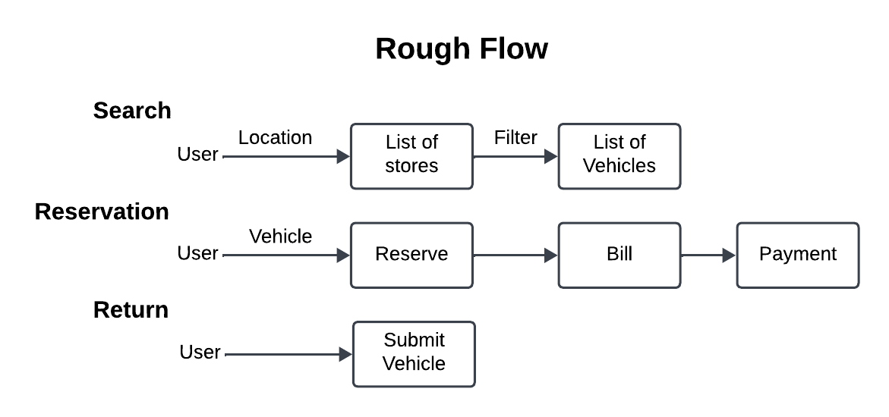
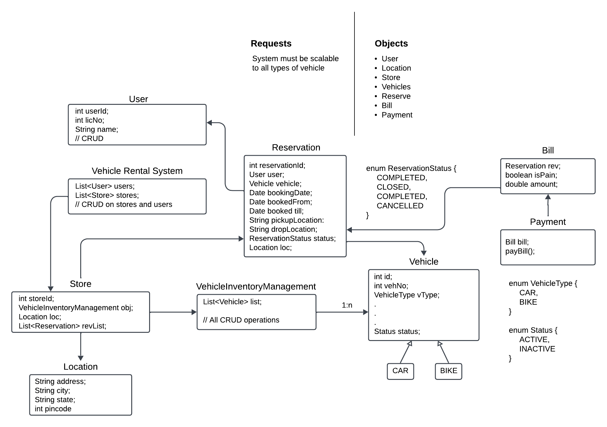

# Car Rental System - Low Level Design (LLD)

This project is a Low-Level Design (LLD) of a **Car Rental System** that demonstrates the core workflow of renting vehicles, managing reservations, and handling payments. The system follows an object-oriented approach and encapsulates key entities such as **Users**, **Stores**, **Vehicles**, and **Reservations**.

## Features

1. **User Management**  
   - Add, retrieve, and manage user details.
   
2. **Store Management**  
   - Retrieve stores based on location.  
   - Manage vehicle inventory in stores.  

3. **Vehicle Inventory**  
   - Add, retrieve, and filter vehicles based on type (e.g., Car, Bike).  

4. **Reservation System**  
   - Create, complete, or cancel reservations.  
   - Track reservation details such as status, type, and user information.  

5. **Billing and Payment**  
   - Generate bills based on reservation details.  
   - Process payments for reservations.

## Workflow

1. **User enters the system**  
   - The user searches for a store based on location.  

2. **Vehicle selection**  
   - The user browses available vehicles in the selected store.  

3. **Reservation creation**  
   - The user reserves a vehicle and generates a reservation ID.  

4. **Bill generation**  
   - A bill is generated for the reservation.  

5. **Payment processing**  
   - The user pays the bill and confirms the reservation.  

6. **Reservation completion**  
   - The user completes the trip, returns the vehicle, and closes the reservation.  

---

## Rough Flow Diagram


## Workflow Diagram


## Class Diagram

### Core Classes

1. **Main**  
   Entry point of the application that demonstrates the end-to-end workflow.

2. **User**  
   Represents a user in the system with attributes like `userId`, `userName`, and `drivingLicense`.

3. **Location**  
   Defines geographical information such as city, state, and country.

4. **Store**  
   Manages the inventory of vehicles and handles reservations.

5. **VehicleRentalSystem**  
   Orchestrates operations such as retrieving stores and managing users.

### Reservation Management

1. **Reservation**  
   Handles the details of a vehicle booking, including status, type, and timestamps.  
   - `ReservationStatus`: Enum for statuses (SCHEDULED, INPROGRESS, COMPLETED, CANCELLED).  
   - `ReservationType`: Enum for reservation types (HOURLY, DAILY).  

2. **Bill**  
   Represents the bill for a reservation, including `totalBillAmount` and payment status.  

3. **Payment**  
   Processes payments and updates the bill status.

### Vehicle Management

1. **Vehicle**  
   Abstract class representing generic attributes of a vehicle (e.g., `vehicleID`, `dailyRentalCost`).  
   - `Car`: Extends `Vehicle` to represent cars.  
   - `Bike`: Extends `Vehicle` to represent bikes.  

2. **VehicleType**  
   Enum for vehicle types (CAR, BIKE).  

3. **VehicleInventoryManagement**  
   Manages the store's vehicle inventory with methods to filter and update vehicles.  

### Utility Enums

1. **Status**  
   Represents whether a vehicle is `ACTIVE` or `INACTIVE`.

---
## How to Run

1. **Compile all Java files**:
   ```bash
   javac Low_Level_Design\LLD_CarRentalSystem\*.java
   ```

2. **Run the Main class**:
   ```bash
   java Low_Level_Design\LLD_CarRentalSystem\Main.java
   ```

---

## Future Enhancements

1. **Support for Additional Vehicle Types**  
   Expand to include other vehicles like trucks, scooters, etc.

2. **Advanced Filtering**  
   Add filters for availability, price, seating capacity, etc.

3. **Real-Time Location Tracking**  
   Integrate GPS for tracking vehicle pick-up and drop-off locations.

4. **Discount and Promotions**  
   Include logic for discount codes and seasonal promotions.

5. **User Reviews and Ratings**  
   Allow users to rate vehicles and stores post-reservation.

---

This project is a Low-Level Design (LLD) template for building a complete Car Rental System. It demonstrates key design principles and object-oriented concepts that can be adapted to real-world applications.

--- 