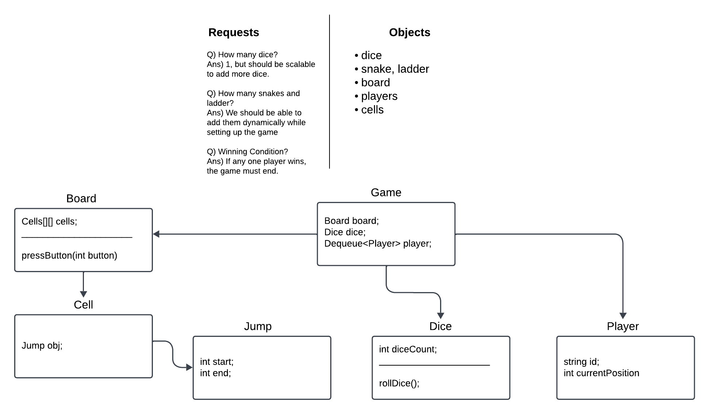

# Snake and Ladder Game - Low Level Design (LLD)

This project demonstrates the **Low-Level Design** (LLD) for the classic **Snake and Ladder Game**. It involves key design principles such as modularity, reusability, and clean object-oriented programming to simulate a board game where players roll dice and navigate a board containing snakes and ladders.

---

## Overview

The game board consists of a grid where:
- **Snakes**: Move the player back to a lower position.
- **Ladders**: Move the player forward to a higher position.
- Players take turns rolling a dice to advance on the board.
- The first player to reach the last cell of the board wins.

### Key Components:
1. **Board**: Represents the game board and manages snakes and ladders.
2. **Cell**: Represents each position on the board; it may contain a snake or ladder (a "Jump").
3. **Jump**: Represents a snake or ladder with a start and end position.
4. **Dice**: Rolls random numbers for player movement.
5. **Player**: Represents a player with an ID and current position.
6. **Game**: Controls the flow of the game, player turns, dice rolls, and checks for winning conditions.

---

## Workflow

1. **Initialization**:
   - A `10x10` board is created with a set number of snakes (5) and ladders (4).
   - Two players are added to the game.
   - A single dice is used to determine movement.

2. **Game Flow**:
   - Players take turns rolling the dice.
   - The dice value determines the player's new position.
   - If the player lands on the head of a **snake**, they move to its tail.
   - If the player lands at the bottom of a **ladder**, they climb to the top.
   - The game continues until one player reaches the final cell on the board.

3. **Winning Condition**:
   - The first player to reach or cross the final position wins the game.

---

## Workflow Diagram


---

## Classes and Their Responsibilities

### 1. **Main**
```java
public class Main {
  public static void main(String[] args) {
    Game obj = new Game();
    obj.startGame();
  }
}
```
- Entry point of the application.
- Initializes and starts the game.

---

### 2. **Board**
```java
public class Board {
  ...
  Cell[][] cells;
  Board(int boardSize, int numSnakes, int numLadders);
}
```
- Initializes a grid of `Cell` objects.
- Randomly places **snakes** and **ladders** on the board.

### 3. **Cell**
```java
public class Cell {
  Jump jump;
}
```
- Represents a single position on the board.
- Holds a `Jump` object for a snake or ladder if present.

### 4. **Jump**
```java
public class Jump {
  int start, end;
}
```
- Represents either a **snake** (start > end) or a **ladder** (start < end).

### 5. **Dice**
```java
public class Dice {
  int rollDice();
}
```
- Simulates rolling one or more dice.

### 6. **Player**
```java
public class Player {
  String id;
  int currentPosition;
}
```
- Represents a player in the game.
- Tracks the player's position on the board.

### 7. **Game**
```java
public class Game {
  public void startGame();
}
```
- Manages the game loop.
- Handles player turns, dice rolls, snakes, ladders, and winning conditions.

---

## Example Game Execution

```text
player turn is: Player 1 current position is: 0
player turn is: Player 1 new Position is: 4
player turn is: Player 2 current position is: 0
player turn is: Player 2 new Position is: 3
jump done by: snake
player turn is: Player 2 new Position is: 1
player turn is: Player 1 current position is: 4
jump done by: ladder
player turn is: Player 1 new Position is: 22
...
WINNER IS: Player 1
```

---

## How to Run

1. **Compile all Java files**:
   ```bash
   javac Low_Level_Design/LLD_SnakeAndLadder/*.java
   ```

2. **Run the Main class**:
   ```bash
   java Low_Level_Design.LLD_SnakeAndLadder.Main
   ```

---

## Flowchart

```
Start
  |
Initialize Board, Players, and Dice
  |
Repeat Until Winner is Found:
  |
  v
Player Rolls Dice --> New Position = Old Position + Dice Value
  |
Check for Snake/Ladder at New Position
  |    \
  |     -> Snake? Move Backward
  |     -> Ladder? Move Forward
  |
Update Player Position
  |
Check for Winning Condition
  |
  v
Winner Found? --> Announce Winner
  |
End
```

---

## Design Principles Used

1. **Single Responsibility Principle (SRP)**:  
   Each class is responsible for only one part of the functionality.
   
2. **Modularity**:  
   The game components are separated into distinct classes for maintainability.

3. **Encapsulation**:  
   State and behavior of each component are encapsulated within their respective classes.

---

## Enhancements (Future Scope)

- Add a graphical user interface (GUI).
- Save and resume game state.

---

## Conclusion

This project demonstrates a clean **Low-Level Design** (LLD) for the Snake and Ladder game, leveraging object-oriented programming principles to ensure a modular, reusable, and scalable design.
