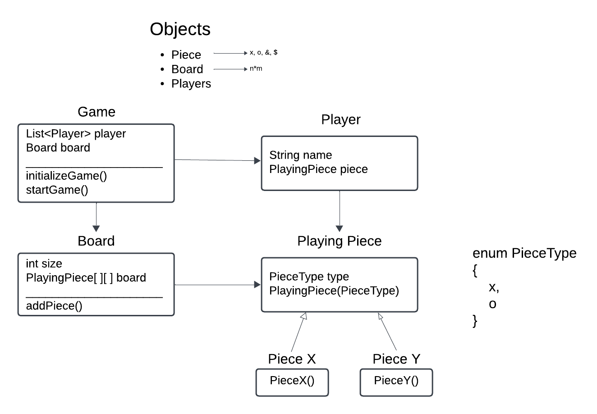

# Tic Tac Toe Game

This project is a **Tic Tac Toe** game implementation designed with low-level design (LLD) principles. It models the game structure using Object-Oriented Programming (OOP) concepts, enabling clear abstraction and scalability.

## Overview

The game is a two-player version of Tic Tac Toe, where players take turns placing their pieces (`X` or `O`) on a 3x3 board. The game ends when a player wins or the board is full, resulting in a draw.

## Class Diagram


### Key Components

1. **Model**  
   - `Board`: Represents the game board, tracks placements, and provides helper methods.  
   - `PlayingPiece` and its subclasses (`PlayingPieceX`, `PlayingPieceO`): Represent the pieces (`X` and `O`) used by players.  
   - `PieceType`: Enum defining the types of pieces (`X`, `O`).  
   - `Player`: Represents a player, holding their name and associated piece type.  

2. **Logic**  
   - `TicTacToeGame`: Contains the core game logic, including player turns, board updates, and winner determination.  

3. **Utility**  
   - `Pair`: A simple utility class to hold a pair of integers (used for free cell tracking).

4. **Main Class**  
   Runs the game by instantiating the `TicTacToeGame` and starting it.

### How to Play

1. Players take turns entering their moves in the format `x,y`, where `x` is the row index and `y` is the column index (0-based).
2. The game checks the move validity and updates the board.
3. A winner is declared if a player gets three in a row (horizontally, vertically, or diagonally). If the board is full, the game ends in a draw.

### Example Output

```text
Player: Player 1 enter x,y: 0,0
X    |      |     
-----------------
     |      |     
-----------------
     |      |     
Player: Player 2 enter x,y: 1,1
X    |      |     
-----------------
     |  O   |     
-----------------
     |      |     
Player: Player 1 enter x,y: 0,1
X    |  X   |     
-----------------
     |  O   |     
-----------------
     |      |     
Player: Player 2 enter x,y: 2,2
X    |  X   |     
-----------------
     |  O   |     
-----------------
     |      |  O  
Player: Player 1 enter x,y: 0,2
X    |  X   |  X  
-----------------
     |  O   |     
-----------------
     |      |  O  
Result: Player 1 is the winner
```

---

### How to Run

1. Compile all `.java` files:
   ```bash
   javac Low_Level_Design/LLD_TicTacToe/**/*.java
   ```

2. Run the `Main` class:
   ```bash
   java Low_Level_Design.LLD_TicTacToe.Main
   ```

---

### Flowchart

```
Start
  |
  v
Initialize TicTacToeGame
  |
  |--- Initialize ---> Board (3x3) and Players (Player 1: X, Player 2: O)
  |
Loop until a winner is found or board is full
  |
  |--- Display board and free spaces
  |--- Ask current player for input (x,y)
  |
  |--- Validate input
        |--- Invalid? --> Ask again
  |
  |--- Place piece on board
  |
  |--- Check for winner
        |--- Winner? --> Announce and End
  |
  |--- No winner? --> Switch turn
  |
End of Loop
  |
  |--- No winner? --> Announce draw
  |
End
```
